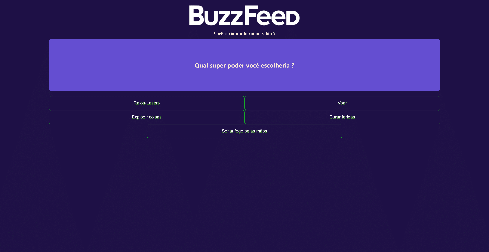

# BuzzFeedAngular

This project was generated with [Angular CLI](https://github.com/angular/angular-cli) version 17.1.1.

## 🚀 Sobre o Projeto "BuzzQuizz"

Este projeto foi desenvolvido como parte do Curso de Formação Angular na Dio (Digital Innovation One), com o propósito de aplicar os conhecimentos adquiridos no framework Angular.

### 🖥️ Tecnologias Utilizadas

-  Angular 17.1.1
-  HTML
-  CSS
-  TypeScript

### 📚 Sobre o BuzzQuizz

O **BuzzQuizz** é uma aplicação de questionários interativos, oferecendo aos usuários a oportunidade de responder a perguntas sobre diversos temas. O projeto visa proporcionar uma experiência prática com o Angular, além de criar uma aplicação educativa e envolvente.

### 📧 Contato

- 📧 E-mail: [arthurcovelo@gmail.com](mailto:arthurcovelo@gmail.com)
- 🔗 LinkedIn: [linkedin.com/in/arthurcovelo](https://www.linkedin.com/in/arthurcovelo/)

Esperamos que aproveite o BuzzQuizz e tenha uma experiência incrível! 🚀
